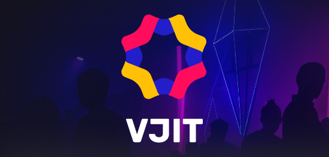

# Open Project IoT

---

📝 NOTE : Ce repository est la suite de [celui-ci](https://github.com/Mow69/capture-video) qui a servi de commencement.

---

##  Pitch

Presentation rapide du concept de votre projet

    <b>
        <i>
            VJ
            '
            IT
            !
        </i>
    </b>

<b><i>VJ'IT!</i></b> est l'invité vedette de tes meilleures soirées. 

Grâce à ses filtres vidéos hyper stylés, deviens toi aussi un VJ légendaire.

Balance tes filtres sur la foule dansante sur le rythme endiablé des meilleurs tubes.

---

##  Stack

Liste des technologies et outils employés dans votre projet

- <b>Technologies :</b>
    - Front-end mobile:
        - Dart
        - Flutter     
    - Back-end
        - MariaDB
        - TypeScrypt
        - NestJs
        - npm
    - Raspberry Pi
        - Python 3
        - pip 3 
        - PyBluez pour la connexion Bluetooth   

---

- <b>Matériel utilisé :</b>
    - 1 Kit complet [Raspberry Pi 4](https://fr.rs-online.com/web/p/raspberry-pi/1822096) Modèle B 4G RAM+64G SD avec [boitier](https://www.amazon.fr/GeeekPi-Raspberry-Ventilateur-40X40X10mm-Dissipateurs/dp/B07XCKNM8J/) écran tactile  
    - [Un écran](https://www.amazon.fr/Moniteur-Portable-Raspberry-capacitif-1024x600/dp/B087GFY4KL) LCD HDMI (non tactile)
    - Un clavier sans fil Rii K12
    - Piles, cables jumper, multiprises, 2 [cables](https://www.amazon.fr/UGREEN-Supporte-Ethernet-Zenbook-UX330UA/dp/B015GR44CG/)  micro HDMI vers HDMI
    - 1 multiprise 220V + USB  
    - 1 [Webcam](https://www.amazon.fr/Logitech-int%C3%A9gr%C3%A9-compatible-Youtube-Facebook/dp/B006A2Q81M)  HD 1080px
    - 1 [Vidéo projecteur](https://www.amazon.fr/Videoprojecteur-Vamvo-Projecteur-Retroprojecteur-Compatibles/dp/B07RB49JSM/) 

---

##  Fonctionnement
Deviens le VJ de la soirée avec l'application mobile VJ'IT!

Depuis l'application installée sur ton smartphone, tu choisis les filtres à afficher sur la ou les sortie(s) que tu veux : écran et/ou rétroprojecteur.

Avec la webcam haute définition branchée au Raspberry, capture des moments inoubliables avec tes amis en train de faire la fête et qui serviront à superposer les filtres.

---

<u>Page d'accueil de l'app mobile de VJ'IT!</u>

---

<u>Page de sélection des filtres dans l'app mobile de VJ'IT!</u>

---

<u>Schéma UML de la base de donnée de VJ'IT!</u>

---

##  Team

Liste des membres de l'équipe projet

EMSI :
- [Marine Gillet](https://github.com/marine2002) (Cheffe de Projet)

DFS21A :
- [Mouaz Saadaoui](https://github.com/Mow69) (Back-end Developer)

DFS24A :
- [Claude Buisson](https://github.com/claude-bssn) (Lead Front-end Developer)
- [Adrien Charrier](https://github.com/4dr1en) (Front-end Developper)
- [Aurélien De Cilla](https://github.com/Ade-cillia) (Back-end Developer)
- [Malek Medjoudj](https://github.com/MAlykylam) (Front-end Developer)

---

##  Demo

Lien vers une vidéo de démonstration du produit fini
